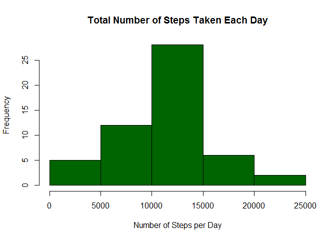
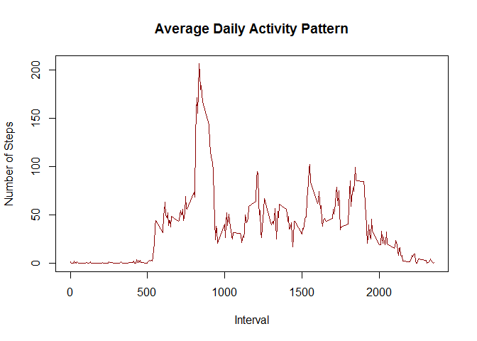
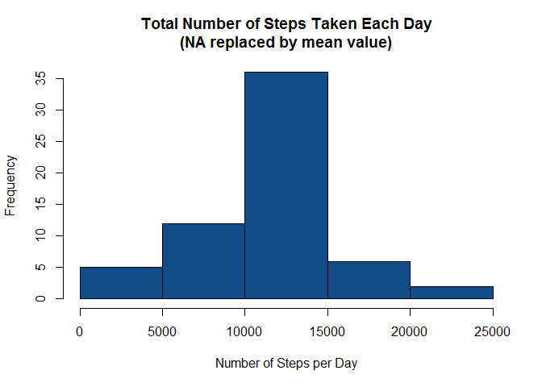
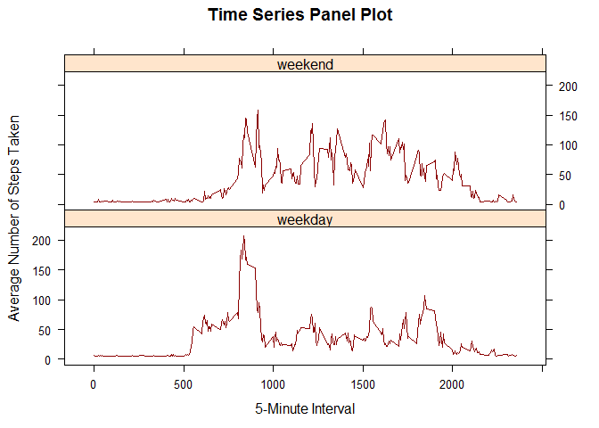

# Reproducible Research: Peer Assessment 1


## Loading and preprocessing the data
#### 1. Make sure that the zip file is in the set working directory. Unpack the zip data file if exist and load data.

```r
if(!file.exists('activity.csv')){
  unzip("activity.zip", list = FALSE)
}
df <- read.csv("activity.csv",colClasses = c("numeric","character","numeric"),stringsAsFactors=FALSE)
```
#### 2. Process/transform the data into a format suitable for analysis

```r
df$date <- as.Date(df$date, "%Y-%m-%d")
dfActivity <- na.omit(df)
str(dfActivity)
```

```
## 'data.frame':	15264 obs. of  3 variables:
##  $ steps   : num  0 0 0 0 0 0 0 0 0 0 ...
##  $ date    : Date, format: "2012-10-02" "2012-10-02" ...
##  $ interval: num  0 5 10 15 20 25 30 35 40 45 ...
##  - attr(*, "na.action")=Class 'omit'  Named int [1:2304] 1 2 3 4 5 6 7 8 9 10 ...
##   .. ..- attr(*, "names")= chr [1:2304] "1" "2" "3" "4" ...
```


## What is mean total number of steps taken per day?
#### 1. Calculate the total number of steps taken per day

```r
mtSTPD <- aggregate(steps ~ date, dfActivity, sum)
head(mtSTPD)
```

```
##         date steps
## 1 2012-10-02   126
## 2 2012-10-03 11352
## 3 2012-10-04 12116
## 4 2012-10-05 13294
## 5 2012-10-06 15420
## 6 2012-10-07 11015
```
#### 2. Make a histogram of the total number of steps taken each day

```r
hist(mtSTPD$steps, main = "Total Number of Steps Taken Each Day", xlab = "Number of Steps per Day", col = "darkgreen")
```

 

#### 3. Calculate and report the mean and median of the total number of steps taken per day

```r
mean(mtSTPD$steps)
```

```
## [1] 10766.19
```

```r
median(mtSTPD$steps)
```

```
## [1] 10765
```

## What is the average daily activity pattern?
#### 1. Make a time series plot (i.e. type = "l") of the 5-minute interval (x-axis) and the average number of steps taken, averaged across all days (y-axis)

```r
stepsInterval <- tapply(dfActivity$steps, dfActivity$interval, mean)
## Plot daily activity pattern
plot(row.names(stepsInterval), stepsInterval, type = "l", xlab = "Interval", 
    ylab = "Number of Steps", main = "Average Daily Activity Pattern", 
    col = "darkred")
```

 

#### 2. Which 5-minute interval, on average across all the days in the dataset, contains the maximum number of steps?

```r
maxInterval <- which.max(stepsInterval)
names(maxInterval)
```

```
## [1] "835"
```

## Imputing missing values
#### 1. Calculate and report the total number of missing values in the dataset.

```r
NAsum <- sum(is.na(df))
NAsum
```

```
## [1] 2304
```
#### 2. Devise a strategy for filling in all of the missing values in the dataset.
##### My strategy is to replace each NA value by the mean of the steps field values. 

```r
## Locate NA positions
locateNA <- which(is.na(df$steps))
meanVal <- rep(mean(df$steps, na.rm=TRUE), times=length(locateNA))
```
#### 3. Create a new dataset that is equal to the original dataset but with the missing data filled in.

```r
dfNew <- df
dfNew[locateNA, "steps"] <- meanVal
## Show data
head(dfNew)
```

```
##     steps       date interval
## 1 37.3826 2012-10-01        0
## 2 37.3826 2012-10-01        5
## 3 37.3826 2012-10-01       10
## 4 37.3826 2012-10-01       15
## 5 37.3826 2012-10-01       20
## 6 37.3826 2012-10-01       25
```
#### 4. Make a histogram of the total number of steps taken each day and Calculate and report the mean and median total number of steps taken per day. Do these values differ from the estimates from the first part of the assignment? What is the impact of imputing missing data on the estimates of the total daily number of steps?


```r
dfNewSteps<- aggregate(steps ~ date, data = dfNew, sum)
hist(dfNewSteps$steps, main = "Total Number of Steps Taken Each Day\n(NA replaced by mean value)", xlab = "Number of Steps per Day", col = "dodgerblue4")
```

 


```r
## Mean total number of steps taken per day
mean(dfNewSteps$steps)
```

```
## [1] 10766.19
```

```r
## Median number of steps taken per day
median(dfNewSteps$steps)
```

```
## [1] 10766.19
```
##### The mean value calculated from the first part and the second part are the same but there median values are different. When missing data were imputed, there was an increased in the peak value but the variation pattern remains the same. 

## Are there differences in activity patterns between weekdays and weekends?

#### 1.Create a new factor variable in the dataset with two levels - "weekday" and "weekend" indicating whether a given date is a weekday or weekend day.

```r
dfWeek <-dfNew
weekends <- weekdays(as.Date(dfWeek$date)) %in% c("Saturday", "Sunday")
dfWeek$weekID <- "weekday"
dfWeek$weekID[weekends == TRUE] <- "weekend"
dfWeek$weekID <- as.factor(dfWeek$weekID)
str(dfWeek)
```

```
## 'data.frame':	17568 obs. of  4 variables:
##  $ steps   : num  37.4 37.4 37.4 37.4 37.4 ...
##  $ date    : Date, format: "2012-10-01" "2012-10-01" ...
##  $ interval: num  0 5 10 15 20 25 30 35 40 45 ...
##  $ weekID  : Factor w/ 2 levels "weekday","weekend": 1 1 1 1 1 1 1 1 1 1 ...
```

#### 2. Make a panel plot containing a time series plot (i.e. type = "l") of the 5-minute interval (x-axis) and the average number of steps taken, averaged across all weekday days or weekend days (y-axis).

```r
weekInterval <- aggregate(steps ~ interval + weekID, dfWeek, mean)
head(weekInterval)
```

```
##   interval  weekID    steps
## 1        0 weekday 7.006569
## 2        5 weekday 5.384347
## 3       10 weekday 5.139902
## 4       15 weekday 5.162124
## 5       20 weekday 5.073235
## 6       25 weekday 6.295458
```

```r
library(lattice)
xyplot(
        steps ~ interval | weekID,
        weekInterval,
        type = "l",
        layout = c(1,2),
        main = "Time Series Panel Plot",
        xlab = "5-Minute Interval",
        ylab = "Average Number of Steps Taken",
        col.line="darkred"
)
```

 


##### Observations: During weekdays there's a significant spike in the activity and has highest peak value on both plots. 
